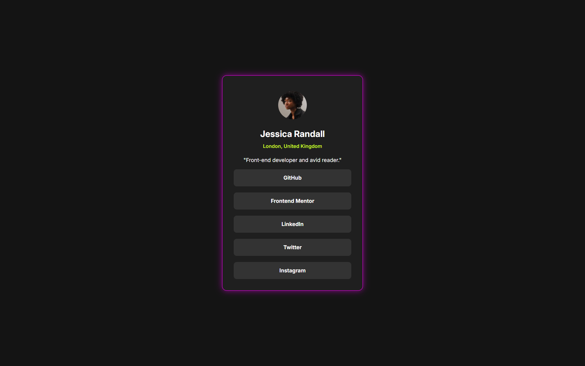

# 🌟 Profile Card Project 🌟

Welcome to the **Profile Card** project! 🚀 This is a sleek, modern, and vibrant front-end project built with **HTML** and **CSS**. It’s a stylish digital card designed to showcase a clean and professional online presence with a neon-inspired aesthetic. Perfect for developers and designers looking to create a visually appealing UI! 😎

---

## 📖 About the Project

This project is a **responsive profile card** crafted to display information and social media links in a dynamic, eye-catching way. Featuring a glowing neon border, modern typography, and a dark theme, it’s a great example of clean front-end design. 🌌 Ideal for portfolios, networking, or learning CSS techniques!

### 🎯 Features
- 🖼️ Circular avatar placeholder
- ✨ Neon pink glowing border effect (`box-shadow`)
- 📍 Highlighted text in vibrant green
- 🔗 Interactive social media buttons with hover effects
- 📱 Fully responsive design for all screen sizes
- 🧑‍💻 Clean and modern layout using Flexbox

---

## 🛠️ Tech Stack
- **HTML5**: Semantic structure for the card
- **CSS3**: Styling with Flexbox, custom fonts, and neon effects
- **Font**: Inter (sans-serif) for readability and elegance
- **Tools**: Visual Studio Code, Browser DevTools

---

## 🚀 Getting Started

Ready to dive into this project? Follow these steps to run or customize it:

1. **Clone the Repository** 🐙
   ```bash
   git clone https://github.com/your-username/profile-card.git
   ```

2. **Open the Project** 📂
   - Navigate to the project folder.
   - Open `index.html` in your browser.

3. **Customize** 🎨
   - Modify `index.html` to update content or links.
   - Replace the placeholder image in the `card-img` class.
   - Edit `style.css` to tweak colors, fonts, or effects (e.g., change the neon glow to blue!).

4. **Deploy** 🌐
   - Host on GitHub Pages, Netlify, or any static hosting platform.

---

## 🎨 Design Highlights
- **Dark Theme**: `hsl(0, 0%, 8%)` background for a sleek, modern vibe.
- **Neon Glow**: `box-shadow: 0 0 16px rgba(255, 0, 255, 0.5)` for a futuristic effect. 💖
- **Typography**: **Inter** font for clean, professional text.
- **Responsive Layout**: Flexbox ensures compatibility across devices.
- **Button Styling**: Hoverable buttons with `hsl(0, 0%, 20%)` background for interactivity.

---

## 🖼️ Preview


---

## 🔗 Links
Explore the demo or adapt it for your own use:
- 🐙 [GitHub Repository](https://github.com/nisargvekariya01/Social_Links_Profiles)
- 🌐 [Live Demo](https://social-link-profiles-nisarg07.netlify.app/)

---

## 💡 Inspiration
Inspired by **Frontend Mentor** challenges, this project showcases how to combine **HTML** and **CSS** to create a polished, professional UI. It’s perfect for practicing CSS Flexbox, responsive design, and creative styling! 💪

---

## 🤝 Contributing
Want to enhance this project? Contributions are welcome! 🙌
1. Fork the repo.
2. Create a new branch (`git checkout -b feature/cool-idea`).
3. Make your changes and commit (`git commit -m 'Add cool feature'`).
4. Push to the branch (`git push origin feature/cool-idea`).
5. Open a Pull Request.

Ideas to contribute:
- 🎨 Add new color themes or animations.
- 📱 Enhance mobile responsiveness.
- 🔧 Optimize CSS for performance.

---

## 🌈 Acknowledgments
- **Frontend Mentor**: For the design inspiration.
- **Inter Font**: For the clean, modern typography.
- **You**: For exploring this project! 🥰

---

⭐ **Star this repo** if you find it useful, and happy coding! 🚀
